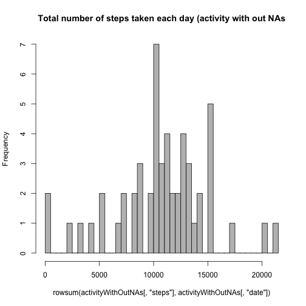
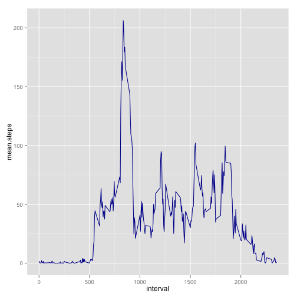
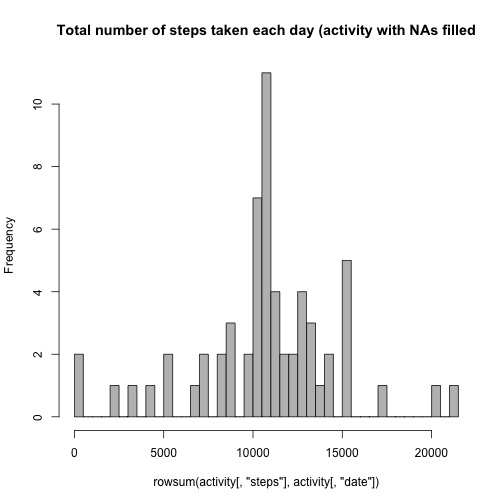
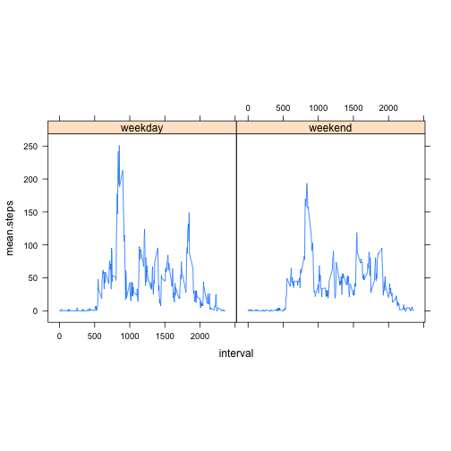

# Reproducible Research: Peer Assessment 1

## Loading and preprocessing the data

```r
# Loading libraries
library(ggplot2)
library(plyr)
library(lattice)
# Data is loaded into a data frame called activity
activity <- read.csv("data/activity.csv")
# The NAs values are removed from activity
activityWithOutNAs <- na.omit(activity)
```


## What is mean total number of steps taken per day?

```r
# the histogram is made on the processed data (activity records without
# NAs), and grouped by 'date'
hist(rowsum(activityWithOutNAs[, "steps"], activityWithOutNAs[, "date"]), breaks = 50, 
    col = "grey", main = "Total number of steps taken each day (activity with out NAs")
```

 

```r
mean(activityWithOutNAs[, "steps"])
```

```
## [1] 37.38
```

```r
median(activityWithOutNAs[, "steps"])
```

```
## [1] 0
```


## What is the average daily activity pattern?

```r
# First of all, we calculate the steps of each interval, averaged across all
# days
activityWONAsMeanStepsByDate <- ddply(activityWithOutNAs, "interval", summarise, 
    mean.steps = mean(steps))
# And then, they are plot
ggplot(activityWONAsMeanStepsByDate) + geom_line(aes(interval, mean.steps), 
    type = "l", colour = "#000099")
```

 

```r
# 5-minute interval that contains the maximum number of steps
activityWONAsMeanStepsByDate[which.max(activityWONAsMeanStepsByDate[, "mean.steps"]), 
    ]
```

```
##     interval mean.steps
## 104      835      206.2
```


## Imputing missing values

```r
# Number of rows with NAs
nrow(activity) - sum(complete.cases(activity))
```

```
## [1] 2304
```

```r
# Strategy for filling the NA values: the mean for that 5-minute interval,
# calculated before Iteration over activity
for (i in 1:nrow(activity)) {
    # if the step value of the row is NA
    if (is.na(activity$steps[i])) 
        # the value 'mean.steps' from activityWONAsMeanStepsByDate that matches the
    # intervals of both data frames is taken
    activity$steps[i] <- activityWONAsMeanStepsByDate$mean.steps[activityWONAsMeanStepsByDate$interval == 
        activity[i, "interval"]]
}

# the histogram is made on the original data which NA values had been filled
hist(rowsum(activity[, "steps"], activity[, "date"]), breaks = 50, col = "grey", 
    main = "Total number of steps taken each day (activity with NAs filled")
```

 

```r
mean(activity[, "steps"])
```

```
## [1] 37.38
```

```r
median(activity[, "steps"])
```

```
## [1] 0
```

```r
# The histogram has the same shape as the previous one. But the frecuencies
# are higher. This is becasue we increased the number of steps but with
# values that were averaged. So each 'bar' was increased in the same
# 'amount' of steps
```


## Are there differences in activity patterns between weekdays and weekends?

```r
# First of all, we create a new factor variable in the by iterating over
# activity
for (i in 1:nrow(activity)) {
    activity$typeOfDay[i] <- ifelse(weekdays(as.Date(activity$date[i])) < "Saturday", 
        "weekday", "weekend")
}
# Then, we calculate the steps of each interval, averaged across
# weekdays/weekends
activityMeanStepsByTypeOfDay <- ddply(activity, .(interval, typeOfDay), summarise, 
    mean.steps = mean(steps))
# And then, they are plot is drawn
xyplot(mean.steps ~ interval | typeOfDay, data = activityMeanStepsByTypeOfDay, 
    pch = ".", type = "l", aspect = 1, layout = c(2, 1))
```

 

